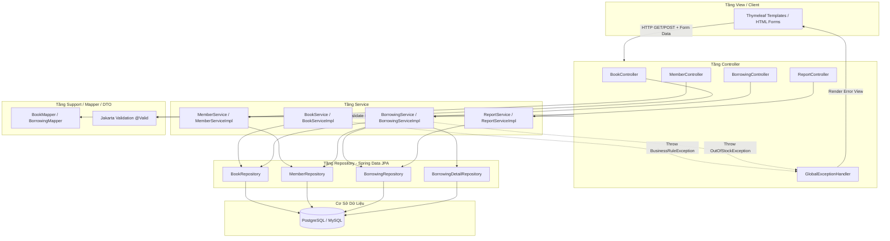
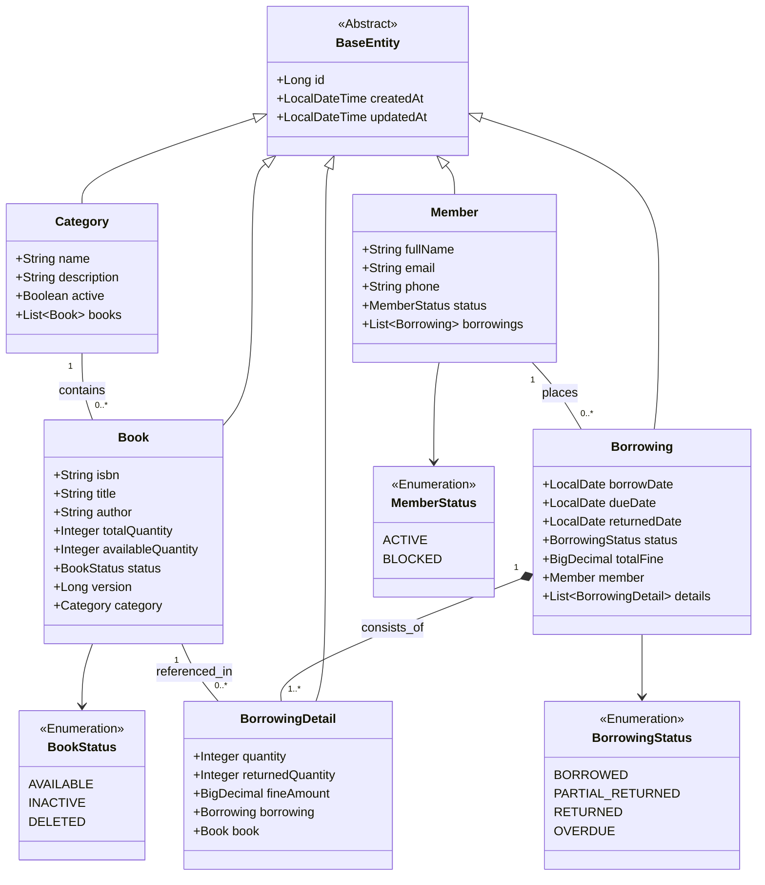
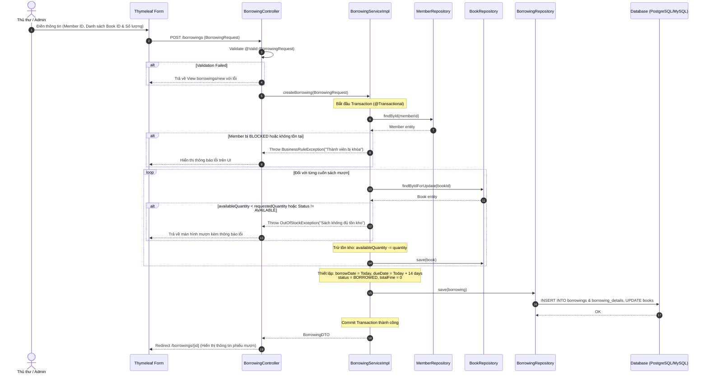
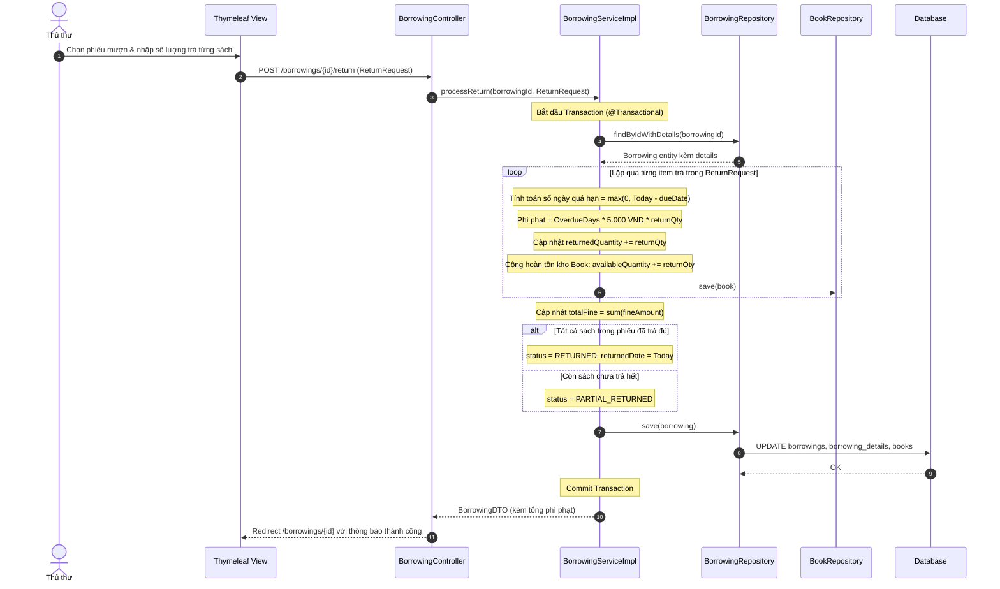

# Sơ Đồ Mã Nguồn & Kiến Trúc Thành Phần (Code Graph & Architecture)

Tài liệu **Code Graph (`codegraph.md`)** cung cấp bản đồ cấu trúc toàn diện của dự án **Spring Boot Library Management System**, bao gồm sơ đồ phân tầng (Layered Architecture), cây thư mục package, biểu đồ lớp (Class Diagram), biểu đồ chuỗi tương tác (Sequence Call Graph) và ma trận ánh xạ các thành phần từ Controller đến Database.

---

## 1. Cấu Trúc Thư Mục & Tổ Chức Package (Directory & Package Layout)

Dự án tuân thủ cấu trúc chuẩn **Maven / Spring Boot 3.x**, chia tầng rõ ràng theo nguyên lý **Single Responsibility Principle (SRP)**:

```text
com.library.management
├── LibraryApplication.java                # Main Entry Point Spring Boot
├── config                                  # Cấu hình hệ thống
│   ├── JpaAuditingConfig.java             # Cấu hình @EnableJpaAuditing (createdAt, updatedAt)
│   ├── MvcConfig.java                     # Cấu hình WebMvc, Interceptor, Resource Handlers
│   └── OpenAPIConfig.java                 # Cấu hình Swagger/OpenAPI 3.0 Documentation
├── controller                             # Tầng Controller (Spring MVC & Rest API)
│   ├── BookController.java                # Quản lý Sách (GET, POST, Form MVC)
│   ├── CategoryController.java            # Quản lý Thể loại
│   ├── MemberController.java              # Quản lý Thành viên
│   ├── BorrowingController.java           # Quản lý Mượn/Trả Sách (Core Business)
│   └── ReportController.java              # Quản lý Báo cáo & Thống kê
├── service                                # Tầng Service (Xử lý nghiệp vụ & Transaction)
│   ├── BookService.java                   # Interface Quản lý Sách
│   ├── CategoryService.java               # Interface Quản lý Thể loại
│   ├── MemberService.java                 # Interface Quản lý Thành viên
│   ├── BorrowingService.java              # Interface Nghiệp vụ Mượn/Trả Sách
│   ├── ReportService.java                 # Interface Báo cáo & Thống kê
│   └── impl                               # Lớp triển khai (Implementations)
│       ├── BookServiceImpl.java
│       ├── CategoryServiceImpl.java
│       ├── MemberServiceImpl.java
│       ├── BorrowingServiceImpl.java     # Thao tác @Transactional, Fine Calculation
│       └── ReportServiceImpl.java
├── repository                             # Tầng Repository (Spring Data JPA)
│   ├── BookRepository.java                # JpaRepository<Book, Long>, Custom Queries
│   ├── CategoryRepository.java            # JpaRepository<Category, Long>
│   ├── MemberRepository.java              # JpaRepository<Member, Long>
│   ├── BorrowingRepository.java           # JpaRepository<Borrowing, Long>
│   └── BorrowingDetailRepository.java     # JpaRepository<BorrowingDetail, Long>
├── entity                                 # Tầng JPA Entities (Domain Models)
│   ├── BaseEntity.java                    # Mẫu Entity cơ sở (id, createdAt, updatedAt)
│   ├── Category.java                      # Bảng categories
│   ├── Book.java                          # Bảng books (@Version Optimistic Lock)
│   ├── Member.java                        # Bảng members
│   ├── Borrowing.java                     # Bảng borrowings
│   └── BorrowingDetail.java               # Bảng borrowing_details
├── dto                                    # Data Transfer Objects & Form Models
│   ├── request
│   │   ├── BookForm.java                  # Form tạo/sửa sách (@Valid constraints)
│   │   ├── MemberForm.java                # Form tạo/sửa thành viên
│   │   ├── CategoryForm.java              # Form tạo thể loại
│   │   ├── BorrowingRequest.java          # Form tạo phiếu mượn (memberId, bookItems)
│   │   └── ReturnRequest.java             # Form trả sách (borrowingId, returnItems)
│   └── response
│       ├── BookDTO.java                   # Response hiển thị Sách
│       ├── MemberDTO.java                 # Response hiển thị Thành viên
│       ├── BorrowingDTO.java              # Response hiển thị Phiếu mượn
│       ├── BorrowingDetailDTO.java        # Response dòng chi tiết phiếu
│       └── OverdueReportDTO.java          # Response DTO báo cáo quá hạn
├── mapper                                 # Chuyển đổi Entity <-> DTO (MapStruct / Manual)
│   ├── BookMapper.java
│   ├── MemberMapper.java
│   ├── CategoryMapper.java
│   └── BorrowingMapper.java
├── enums                                  # Định nghĩa hằng số Enum
│   ├── BookStatus.java                    # AVAILABLE, INACTIVE, DELETED
│   ├── MemberStatus.java                  # ACTIVE, BLOCKED
│   └── BorrowingStatus.java               # BORROWED, PARTIAL_RETURNED, RETURNED, OVERDUE
├── exception                              # Xử lý Lỗi & Ngoại lệ Global
│   ├── ResourceNotFoundException.java     # Lỗi không tìm thấy dữ liệu (404)
│   ├── BusinessRuleException.java         # Lỗi vi phạm quy tắc nghiệp vụ (400)
│   ├── OutOfStockException.java           # Lỗi hết sách tồn kho
│   ├── InsufficientPermissionException.java
│   └── GlobalExceptionHandler.java        # @ControllerAdvice xử lý lỗi cho Thymeleaf & Rest
└── specification                          # JPA Specifications cho Dynamic Search
    ├── BookSpecification.java             # Dynamic search theo title, author, isbn, category
    └── BorrowingSpecification.java        # Dynamic search theo member, status, date
```

---

## 2. Biểu Đồ Phụ Thuộc Thành Phần (Component Dependency Graph)

Sơ đồ mô tả luồng phụ thuộc dữ liệu và điều hướng giữa các thành phần trong hệ thống:



---

## 3. Biểu Đồ Lớp Entities & JPA Relationships (Class Diagram)

Các Entity chính và mối quan hệ giữa chúng trong Spring Data JPA:



---

## 4. Luồng Thực Thi Chi Tiết & Biểu Đồ Chuỗi (Sequence Call Graphs)

### 4.1. Luồng Tạo Phiếu Mượn Sách (`POST /borrowings`)

Mô tả quá trình kiểm tra ràng buộc nghiệp vụ, trừ tồn kho và ghi nhận phiếu mượn trong `@Transactional`:



---

### 4.2. Luồng Trả Sách & Tính Phí Quá Hạn (`POST /borrowings/{id}/return`)

Mô tả quy trình xử lý trả sách từng phần/toàn bộ, tính tiền phạt $5.000$ VNĐ/ngày/cuốn quá hạn và hoàn lại tồn kho:



---

## 5. Ma Trận Chi Tiết Các Lớp Trong Hệ Thống (Class Specification Matrix)

### 5.1. Tầng Controllers & Views

| Tên Class Controller | Dynamic Annotations | Services Phụ Thuộc Injection | Các Routes Xử Lý Chính | View Template Tương Ứng |
| :--- | :--- | :--- | :--- | :--- |
| **`BookController`** | `@Controller`<br>`@RequestMapping("/books")` | `BookService`<br>`CategoryService` | `GET /books`<br>`GET /books/new`<br>`POST /books`<br>`GET /books/{id}/edit`<br>`POST /books/{id}` | `books/list.html`<br>`books/form.html`<br>`books/detail.html` |
| **`MemberController`** | `@Controller`<br>`@RequestMapping("/members")` | `MemberService` | `GET /members`<br>`GET /members/new`<br>`POST /members`<br>`POST /members/{id}/toggle-status` | `members/list.html`<br>`members/form.html` |
| **`BorrowingController`** | `@Controller`<br>`@RequestMapping("/borrowings")` | `BorrowingService`<br>`MemberService`<br>`BookService` | `GET /borrowings`<br>`GET /borrowings/new`<br>`POST /borrowings`<br>`GET /borrowings/{id}`<br>`POST /borrowings/{id}/return` | `borrowings/list.html`<br>`borrowings/new.html`<br>`borrowings/detail.html`<br>`borrowings/return.html` |
| **`ReportController`** | `@Controller`<br>`@RequestMapping("/reports")` | `ReportService` | `GET /reports/overdue`<br>`GET /reports/top-books`<br>`GET /reports/member-stats` | `reports/overdue.html`<br>`reports/top-books.html` |

---

### 5.2. Tầng Services & Repositories

| Interface Service | Implementation Class | Annotation Key | Repositories Inject | Trách Nhiệm Nghiệp Vụ Chính |
| :--- | :--- | :--- | :--- | :--- |
| **`BookService`** | `BookServiceImpl` | `@Service`<br>`@Transactional(readOnly)` | `BookRepository`<br>`CategoryRepository` | CRUD Sách, lọc phân trang, kiểm tra mã ISBN trùng, chuyển đổi trạng thái. |
| **`MemberService`** | `MemberServiceImpl` | `@Service`<br>`@Transactional(readOnly)` | `MemberRepository` | CRUD Thành viên, validate email độc nhất, khóa/mở khóa tài khoản. |
| **`BorrowingService`** | `BorrowingServiceImpl` | `@Service`<br>`@Transactional` | `BorrowingRepository`<br>`BorrowingDetailRepository`<br>`BookRepository`<br>`MemberRepository` | Tạo phiếu mượn (trừ tồn kho), trả sách từng phần (cộng tồn kho), tính phí phạt quá hạn 5k/ngày. |
| **`ReportService`** | `ReportServiceImpl` | `@Service`<br>`@Transactional(readOnly)` | `BorrowingRepository`<br>`BookRepository` | Thống kê phiếu quá hạn, top 5 sách mượn nhiều nhất, tổng hợp lượt mượn theo thành viên. |

---

## 6. Ánh Xạ Luồng Tương Tác Tận Cùng (End-to-End Execution Map)

Bảng tra cứu chi tiết luồng xử lý từ Thao tác UI $
ightarrow$ Route $
ightarrow$ Method $
ightarrow$ DB Query:

| Thao Tác Người Dùng | HTTP Method & Route | Controller Method | Service Method | Repository / Query Executed | View / Redirect Destination |
| :--- | :--- | :--- | :--- | :--- | :--- |
| **Tìm kiếm & Phân trang sách** | `GET /books?keyword=java&page=0` | `BookController.listBooks()` | `BookService.findAll(spec, pageable)` | `SELECT b FROM Book b WHERE ... LIMIT 10 OFFSET 0` | `books/list.html` |
| **Thêm mới Sách** | `POST /books` | `BookController.createBook()` | `BookService.createBook(BookForm)` | `INSERT INTO books (isbn, title, total_quantity, available_quantity...)` | `redirect:/books` |
| **Tạo Phiếu Mượn** | `POST /borrowings` | `BorrowingController.create()` | `BorrowingService.createBorrowing()` | `UPDATE books SET available_quantity = available_quantity - ? WHERE id = ?`<br>`INSERT INTO borrowings ...` | `redirect:/borrowings/{id}` |
| **Trả sách (Từng phần)** | `POST /borrowings/{id}/return` | `BorrowingController.processReturn()` | `BorrowingService.processReturn()` | `UPDATE borrowing_details SET returned_quantity = ? ...`<br>`UPDATE books SET available_quantity = available_quantity + ?` | `redirect:/borrowings/{id}` |
| **Xem báo cáo quá hạn** | `GET /reports/overdue` | `ReportController.overdueReport()` | `ReportService.getOverdueReport()` | `SELECT b FROM Borrowing b WHERE b.dueDate < CURRENT_DATE AND b.status != 'RETURNED'` | `reports/overdue.html` |

---

> **Ghi chú bảo trì**: Tài liệu này cần được cập nhật song song khi có thay đổi về cấu trúc package, tên API endpoint hoặc logic nghiệp vụ cốt lõi của hệ thống.
